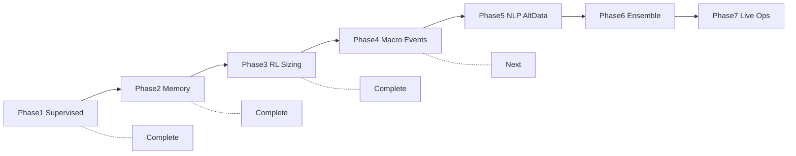
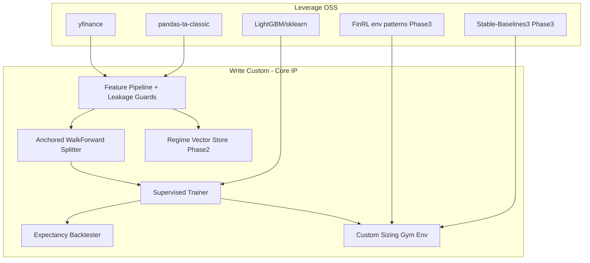
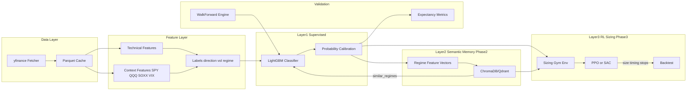
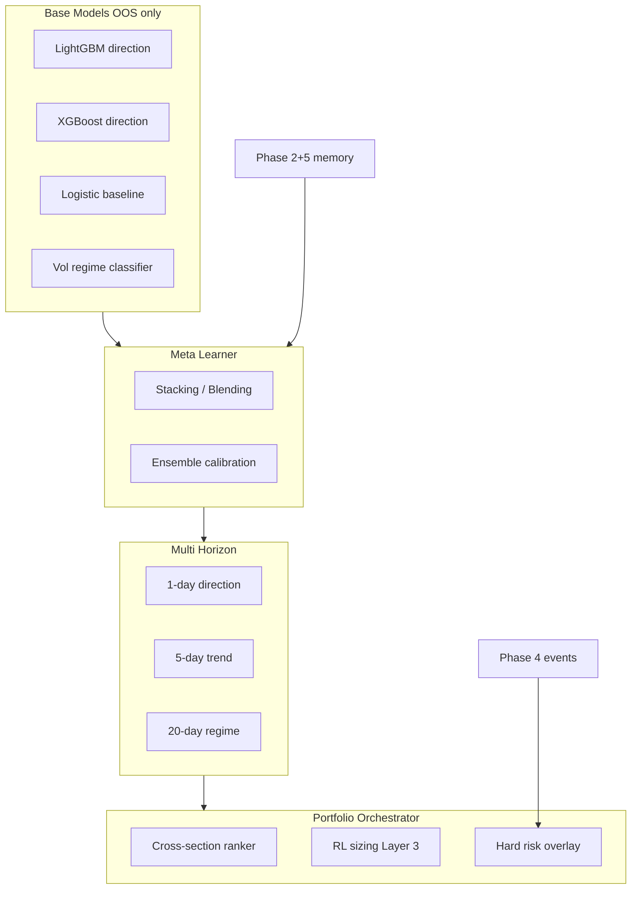

# Hybrid AI Investment Radar — Implementation Blueprint

## Executive Summary

Build a **hybrid, non-naive quant system** in [`/Users/romankoller/Privat/TradingBot`](/Users/romankoller/Privat/TradingBot) with seven evolutionary phases:

| Phase | Status | Focus |
|-------|--------|-------|
| **1** | Complete | Supervised prediction + walk-forward validation |
| **2** | Complete | Semantic regime memory (ChromaDB) |
| **3** | Complete | RL position sizing (PPO) |
| **4** | Planned | Macro cross-asset + event calendar intelligence |
| **5** | Planned | NLP sentiment + alternative data fusion |
| **6** | Planned | Ensemble meta-model + multi-horizon orchestration |
| **7+** | Future | Production live deployment |

**Core layers (unchanged principle):**
1. **Supervised prediction** — direction, volatility regime, setup quality
2. **Semantic memory** — similar historical macro/event regimes
3. **RL optimization** — position sizing / timing only, never raw price prediction

**Confirmed universe:**
- **Traded:** AAPL, MSFT, NVDA, GOOGL, AMZN
- **Context:** SPY, QQQ, SOXX, ^VIX (+ expanded macro in Phase 4)
- **Bar frequency:** daily OHLCV; multi-horizon labels added in Phase 6

### Long-term roadmap



---

## Open-Source Evaluation & Stack Decision

| Tool | Verdict | Role |
|------|---------|------|
| **[ItzSwapnil/DART](https://github.com/ItzSwapnil/DART)** | **Reject** | ~4 stars, 98% HTML/docs, immature Python core, RL+ML entangled — not institutional-grade |
| **[AI4Finance-Foundation/FinRL](https://github.com/AI4Finance-Foundation/FinRL)** | **Adopt patterns only (Phase 3)** | Mature Gym env + Stable-Baselines3 integration; we fork the *env abstraction*, not the DRL-for-price-prediction tutorials |
| **[AI4Finance-Foundation/FinRL-Trading (FinRL-X)](https://github.com/AI4Finance-Foundation/FinRL-Trading)** | **Defer to Phase 7+** | Strong end-to-end platform; revisit for broker-integrated deployment |
| **[edtechre/pybroker](https://www.pybroker.com/)** | **Optional helper** | Portfolio simulation; useful in Phase 6 integrated backtests |
| **[nautechsystems/nautilus_trader](https://github.com/nautechsystems/nautilus_trader)** | **Phase 7+ live path** | Production event-driven engine with backtest/live parity |
| **yfinance + FRED** | **Phase 1 + 4 data** | Free OHLCV; FRED for rates/credit macro series |
| **Alpaca / Polygon** | **Phase 5+ paid data** | News, options chains, intraday when needed |
| **GDELT / FinBERT** | **Phase 5 NLP** | Geopolitical event volume + financial headline sentiment |
| **pandas-ta-classic** | **Primary TA library** | Pure-Python, 164+ indicators, optional TA-Lib acceleration; avoids original `pandas-ta` paywall |
| **TA-Lib** | **Optional dev dependency** | Faster core indicators when wheels install cleanly on macOS |
| **LightGBM + scikit-learn** | **Phase 1 ML core** | Tabular ensembles for directional probability + calibration |
| **Gymnasium + Stable-Baselines3** | **Phase 3 RL** | PPO/SAC for sizing env |

### What we leverage vs write manually



---

## System Architecture (All Phases)



**Hard rule:** Layer 3 state vector includes Layer 1 outputs (`p_up`, `p_down`, `vol_regime`, `setup_quality`) plus portfolio risk — never raw OHLCV alone as the sole RL input.

---

## Phase 1 — Data, Features, Supervised Core, Walk-Forward Expectancy *(Complete)*

### 1.1 Project bootstrap

Initialize Python 3.11+ project with `pyproject.toml`, `uv` or `pip`, strict typing, and pytest.

**Core dependencies (Phase 1):**
- `yfinance`, `pandas`, `numpy`, `pyarrow`
- `pandas-ta-classic`
- `lightgbm`, `scikit-learn`, `optuna` (optional hyperparam tuning)
- `pyyaml`, `pydantic-settings`, `structlog`
- `matplotlib`, `seaborn` (reports)

**Optional:** `TA-Lib` (via conda-forge or wheel if macOS install succeeds)

### 1.2 Directory structure (Phase 1)

```
TradingBot/
├── pyproject.toml
├── README.md
├── .env.example
├── .gitignore
├── config/
│   ├── default.yaml           # tickers, date ranges, paths
│   ├── features.yaml          # indicator params, lags
│   └── walkforward.yaml       # split schedule (anchored expanding)
├── data/
│   ├── raw/                   # parquet per symbol (gitignored)
│   ├── processed/             # feature matrices per split
│   └── cache/
├── src/radar/
│   ├── __init__.py
│   ├── config/
│   │   ├── settings.py        # Pydantic settings from YAML + env
│   │   └── schemas.py
│   ├── data/
│   │   ├── fetcher.py         # yfinance download + retry/rate-limit
│   │   ├── store.py           # read/write parquet, manifest
│   │   ├── adapters/base.py   # pluggable DataSource ABC
│   │   └── validators.py      # gaps, splits, timezone checks
│   ├── features/
│   │   ├── pipeline.py        # orchestrates per-symbol feature build
│   │   ├── technical.py       # RSI, MACD, VWAP, ATR, BBands via pandas-ta
│   │   ├── context.py           # SPY/QQQ/SOXX/VIX relative features
│   │   ├── labels.py          # next-day direction, vol regime buckets
│   │   └── leakage.py         # shift/lag guards, as-of joins
│   ├── models/
│   │   ├── supervised/
│   │   │   ├── trainer.py     # fit per walk-forward fold
│   │   │   ├── lightgbm_model.py
│   │   │   └── calibration.py # isotonic or Platt scaling
│   │   └── registry.py        # save/load model artifacts per fold
│   ├── validation/
│   │   ├── walk_forward.py    # ANCHORED EXPANDING splits (non-negotiable)
│   │   ├── splits.py          # split generator from config
│   │   └── metrics.py         # AUC, Brier, calibration, expectancy
│   ├── backtest/
│   │   ├── expectancy.py      # E = (Pw*Aw) - (Pl*Al) on OOS predictions
│   │   ├── signal_rules.py    # threshold-based long/flat (no RL yet)
│   │   └── report.py          # HTML/JSON fold reports
│   └── cli/
│       ├── fetch_data.py
│       ├── build_features.py
│       ├── train.py
│       └── backtest.py
├── tests/
│   ├── test_walk_forward_no_shuffle.py
│   ├── test_feature_leakage.py
│   ├── test_labels_shift.py
│   └── test_expectancy.py
├── notebooks/
│   └── phase1_eda.ipynb
└── artifacts/
    ├── models/                # gitignored
    └── reports/               # gitignored
```

### 1.3 Data pipeline

**[`config/default.yaml`](config/default.yaml)** (essential fields):

```yaml
universe:
  traded: [AAPL, MSFT, NVDA, GOOGL, AMZN]
  context: [SPY, QQQ, SOXX, "^VIX"]
data:
  start_date: "2018-01-01"
  end_date: null  # latest
  interval: "1d"
  source: yfinance
```

**Fetcher responsibilities** ([`src/radar/data/fetcher.py`](src/radar/data/fetcher.py)):
- Download adjusted OHLCV per ticker; normalize column names
- Persist to `data/raw/{symbol}.parquet` with fetch timestamp metadata
- Validate: no duplicate dates, handle missing VIX holidays, forward-fill only for context series (never for labels)

**Adapter pattern:** `DataSource` ABC with `YFinanceSource` implementation; `FREDSource`, `AlpacaSource`, `PolygonSource` stubs for Phases 4–5.

### 1.4 Feature engineering (structured vectors only)

**Per traded symbol, at end-of-day `t`, features use data ≤ `t` only:**

| Category | Features |
|----------|----------|
| Price/vol | returns (1/5/20d), log-return, ATR%, realized vol, gap |
| Momentum | RSI(14), MACD histogram, ADX, ROC |
| Mean-reversion | distance from VWAP, BBands %B |
| Volume | OBV slope, volume z-score |
| Context | SPY/QQQ/SOXX 20d trend, beta to SPY, VIX level & 5d change, correlation to SOXX |
| Cross-section | rank vs other 4 stocks on 5d momentum (no future info) |

**Labels** ([`src/radar/features/labels.py`](src/radar/features/labels.py)):
- `y_direction`: 1 if `close[t+1] > close[t]`, else 0 (configurable threshold for noise filter, e.g. ±0.1%)
- `y_vol_regime`: tercile bucket of next-day realized vol (low/med/high)
- `setup_quality`: meta-label = direction correct AND move > cost threshold (for Phase 3 reward shaping)

**Leakage guards** ([`src/radar/features/leakage.py`](src/radar/features/leakage.py)):
- All indicators shifted by 1 bar minimum before joining labels
- Context features joined on date with inner merge; no `bfill`
- Unit tests assert max feature timestamp ≤ label decision timestamp per row

### 1.5 Supervised model (Layer 1)

**Model:** LightGBM binary classifier (primary), with XGBoost as config-toggle alternative.

**Training per fold:**
1. Fit on train split only
2. Early stopping on internal time-based validation slice (last 10% of train period — still no test data)
3. Calibrate probabilities (isotonic regression on validation slice)
4. Output: `p_up`, `p_down = 1 - p_up`, `vol_regime` (separate multiclass LGBM or derived from regression)

**Outputs persisted per fold:**
- `artifacts/models/{fold_id}/model.lgb`
- `artifacts/models/{fold_id}/calibrator.pkl`
- `artifacts/models/{fold_id}/feature_manifest.json`

### 1.6 Walk-forward validation (NON-NEGOTIABLE)

**Forbidden:** random CV, shuffle, stratified K-fold on pooled time series.

**Required:** anchored expanding windows defined in [`config/walkforward.yaml`](config/walkforward.yaml):

```yaml
walkforward:
  mode: anchored_expanding
  min_train_days: 504        # ~2 years
  test_window: monthly       # or "30D"
  step: monthly
  purge_days: 1              # gap between train end and test start
  embargo_days: 0
```

**Example fold schedule (matches your spec):**

| Fold | Train | Test |
|------|-------|------|
| 1 | 2018–2021 | Jan 2022 |
| 2 | 2018–2022 | Jan 2023 |
| 3 | 2018–2023 | Feb 2024 |
| ... | expanding | next month |

Implementation in [`src/radar/validation/walk_forward.py`](src/radar/validation/walk_forward.py):
- `generate_splits(df, config) -> list[FoldSplit]`
- Each fold retrains from scratch (no warm-start across folds for honest OOS)
- Aggregate OOS predictions across all folds into single out-of-sample series

### 1.7 Expectancy backtester (Phase 1 deliverable)

**Signal rule (simple, no RL):** go long when `p_up > threshold` (default 0.55), flat otherwise.

**Expectancy per fold and pooled OOS:**

\[
E = (P_w \times A_w) - (P_l \times A_l)
\]

Where wins/losses are computed on next-day returns of signaled trades.

**Additional metrics:** hit rate, avg win/loss, profit factor, max drawdown (equity curve), Brier score, calibration curve.

**Report:** [`src/radar/backtest/report.py`](src/radar/backtest/report.py) writes `artifacts/reports/walkforward_{timestamp}.json` + summary HTML.

### 1.8 Phase 1 CLI workflow

```bash
# 1. Fetch data
python -m radar.cli.fetch_data

# 2. Build features (all symbols)
python -m radar.cli.build_features

# 3. Train walk-forward folds
python -m radar.cli.train --config config/walkforward.yaml

# 4. Run expectancy backtest on OOS predictions
python -m radar.cli.backtest --report
```

### 1.9 Phase 1 exit criteria

- All tests pass (`test_walk_forward_no_shuffle`, `test_feature_leakage`)
- OOS predictions exist for every fold with no timestamp overlap violations
- Expectancy report generated for all 5 symbols + pooled portfolio
- Reproducible run from clean `data/raw/` with pinned dependency versions

---

## Phase 2 — Semantic Memory Layer *(Complete)*

### Goal
Retrieve **similar historical macro regimes** to modulate Layer 1 confidence or Layer 3 sizing — not to predict prices directly.

### Delivered
- ChromaDB vector store with daily regime vectors
- No-lookahead similarity retrieval features joined to feature panel
- CLI: `python -m radar.cli.build_memory_index`

### Stack
- **Vector DB:** ChromaDB (local, persistent)
- **Embeddings:** structured regime vectors (VIX, SPY trend, cross-asset correlation, vol cluster)

### Regime vector composition (daily)
- VIX level/z-score, SPY trend, sector dispersion (SOXX vs SPY spread)
- Cross-asset correlation matrix (5 stocks + indices)
- Volatility cluster from rolling VIX percentile

### Files
```
src/radar/memory/
├── regime_encoder.py
├── vector_store.py
├── retrieval.py
└── cli/build_memory_index.py
```

---

## Phase 3 — RL Risk & Sizing Layer *(Complete)*

### Goal
RL optimizes **position size, entry timing, stop-loss multiplier** given Layer 1 probabilities + portfolio state. RL never sees raw charts or predicts prices independently.

### Delivered
- `RadarSizingEnv` (Gymnasium) with 11-dim state, MultiDiscrete actions
- Risk-adjusted reward (drawdown, vol, turnover, Sortino bonus)
- PPO training on OOS prediction stream; held-out chronological evaluation
- CLI: `python -m radar.cli.train_rl`, `python -m radar.cli.evaluate_rl`

### Foundation
- FinRL env pattern (not full FinRL pipeline)
- Stable-Baselines3 PPO

### State space
```
[p_up, p_down, vol_regime_onehot(3), setup_quality,
 current_exposure, unrealized_pnl, rolling_drawdown_20d,
 days_in_position, regime_similarity_score]
```

### Action space
- `position_target`: [0.0, 0.25, 0.5, 0.75, 1.0]
- `stop_atr_mult`: [1.0, 1.5, 2.0, 2.5]

### Files
```
src/radar/rl/
├── envs/sizing_env.py
├── rewards/risk_adjusted.py
├── data_stream.py
├── train_sizing.py
├── evaluate_policy.py
└── cli/train_rl.py, evaluate_rl.py
```

---

## Phase 4 — Macro & Event Intelligence Layer

### Goal
Expand **structured context** beyond equity indices — rates, credit, USD, vol structure, and a unified **event calendar** — to improve regime detection and Layer 1 directional accuracy. No NLP yet; all features are numeric or binary flags.

### Why this phase first
Highest signal-to-noise ratio for daily mega-cap tech prediction. Cheaper than NLP, easier to validate walk-forward, directly extends existing `context.py` and `regime_encoder.py`.

### New data sources

| Category | Symbols / Source | Features |
|----------|------------------|----------|
| Rates | `^TNX`, `^IRX`, `^FVX` via yfinance; FRED DGS2/DGS10 | level, 20d change, curve slope (10Y−2Y) |
| Credit | `HYG`, `LQD`, `TLT` | HYG/LQD ratio, spread proxy, flight-to-quality |
| USD | `DX-Y.NYB` or `UUP` | level, 5d/20d trend |
| Vol structure | `^VVIX`, VIX term proxy | vol-of-vol, VIX/VVIX ratio |
| Sector | `XLK`, `SMH` | rotation vs SPY |

### Event calendar pipeline

Build [`data/processed/events.parquet`](data/processed/events.parquet) with strict timestamps:

| Event type | Source | Features per row |
|------------|--------|----------------|
| Macro | FOMC, CPI, NFP, GDP dates (CSV/API) | `days_to_event`, `is_event_day`, `is_post_event_day` |
| Earnings | yfinance / earnings calendar API | per-symbol `days_to_earnings`, `is_earnings_week` |
| Geopolitical flags | Manual seed + GDELT escalation score (Phase 5 prep) | `geo_risk_flag`, `conflict_intensity` |

**Rule:** event features available only after public release time; macro events use prior-day flag for pre-event positioning.

### Integration

```
src/radar/
├── data/adapters/fred_source.py      # FRED API adapter
├── features/macro.py               # rates, credit, USD features
├── features/events.py              # calendar flags, days-to-event
├── events/
│   ├── calendar_builder.py         # ingest + normalize events
│   └── seed/macro_dates.csv        # FOMC/CPI/NFP seed data
└── cli/build_event_calendar.py
```

- Extend `regime_encoder.py` with macro dimensions (curve slope, credit stress, USD trend)
- Ablation test: re-run walk-forward with/without macro features; require OOS AUC or expectancy lift

### Phase 4 exit criteria
- Macro + event features pass leakage tests
- Walk-forward ablation report shows measurable OOS delta (or documented null result)
- Event-day RL sizing cap configurable in `config/rl.yaml` (`max_size_on_event_day: 0.25`)

---

## Phase 5 — NLP Sentiment & Alternative Data Fusion

### Goal
Ingest **unstructured and semi-structured external signals** — news, geopolitical events, options-implied metrics — and fuse them into **Layer 2 semantic memory** and Layer 1 as daily aggregates (never raw text in the supervised model).

### Design principle
Text becomes **regime descriptors and gating signals**, not direct price predictors. All NLP outputs are daily scalar aggregates with timestamps.

### Data modules

| Module | Source | Daily outputs |
|--------|--------|---------------|
| Headline sentiment | Alpaca News / Polygon / RSS + FinBERT | `news_sentiment_mean`, `news_volume_zscore`, `sentiment_delta_1d` |
| Symbol-specific news | Per-ticker headline filter | `symbol_sentiment`, `symbol_news_count` |
| Geopolitical | GDELT event database | `geo_event_count`, `geo_goldstein_scale`, `geo_escalation_flag` |
| Options-implied | Polygon options / CBOE proxies | `iv_rank`, `iv_skew_change`, `put_call_ratio` |
| Social (optional, defer if noisy) | Reddit/Twitter APIs | `social_volume_zscore` only — no raw posts |

### NLP pipeline

```
src/radar/nlp/
├── ingest/
│   ├── news_fetcher.py             # pluggable NewsSource ABC
│   └── gdelt_fetcher.py            # daily geopolitical aggregates
├── sentiment/
│   ├── finbert_scorer.py           # batch headline scoring
│   └── daily_aggregator.py         # symbol + macro daily rollups
├── altdata/
│   ├── options_features.py         # IV rank, skew, PCR
│   └── embedder.py                 # sentence-transformers for memory
├── fusion/
│   └── memory_enricher.py          # append text embeddings to ChromaDB
└── cli/build_sentiment_index.py
```

### Semantic memory upgrade
- Extend ChromaDB regime documents with **text embedding sidecars** (FOMC week summaries, conflict clusters)
- Retrieval returns: similar regime + `neighbor_sentiment` + `neighbor_geo_risk`
- RL state gains: `regime_sentiment_score`, `geo_escalation_flag`, `iv_rank`

### Validation guardrails
- Headlines timestamped; only use headlines with `published_at <= market_close(t)`
- Walk-forward ablation per signal family (news only, geo only, options only)
- Monitor feature drift: sentiment distribution shift alerts

### Phase 5 exit criteria
- Daily sentiment + altdata parquet merged into feature panel
- ChromaDB index includes hybrid structured + text embeddings
- Documented OOS ablation per data family
- No degradation in calibration (Brier score) when adding NLP features

---

## Phase 6 — Ensemble Meta-Model & Multi-Horizon Orchestration

### Goal
Combine all signal layers into a **production-grade prediction stack** — multiple base models, a meta-learner, multi-horizon targets, and portfolio-level decision orchestration — while preserving strict walk-forward integrity.

### Architecture



### Base model ensemble
Train independently per walk-forward fold (no peeking):
- LightGBM (current)
- XGBoost (config toggle)
- Regularized logistic regression (sanity baseline)
- Optional: small temporal CNN on feature sequences (only if OOS lift proven)

**Meta-learner:** sklearn `StackingClassifier` or LightGBM second stage trained on **OOS base predictions only** (nested walk-forward).

Outputs:
- `p_up_ensemble`, `p_up_std` (disagreement = uncertainty flag)
- `setup_quality_ensemble`

### Multi-horizon labels
| Horizon | Label | Use |
|---------|-------|-----|
| 1-day | next-day direction | primary signal |
| 5-day | trend sign over 5 sessions | swing filter |
| 20-day | regime bucket | position bias |

RL and sizing use 1-day probability modulated by 5-day/20-day agreement (gate: reduce size when horizons conflict).

### Portfolio orchestrator
Replace single-symbol RL episodes with **daily portfolio step**:
- Rank 5 symbols by `p_up_ensemble × setup_quality`
- Allocate capital across top-N with RL size multiplier per name
- Hard constraints: max gross exposure, max single-name weight, event-day caps

```
src/radar/ensemble/
├── base_models.py
├── meta_learner.py
├── multi_horizon.py
├── portfolio_env.py          # multi-asset RadarSizingEnv v2
├── orchestrator.py
└── cli/train_ensemble.py
```

### Integrated backtest
- Full pipeline: fetch → features → macro → sentiment → ensemble → memory → RL → report
- Compare: Phase 1 baseline vs Phase 6 full stack (same walk-forward splits)
- Metrics: expectancy, Sharpe, max DD, calibration, turnover, horizon agreement rate

### Phase 6 exit criteria
- Ensemble beats best single model OOS on ≥2 of 3 metrics (AUC, expectancy, Sharpe)
- Portfolio orchestrator backtest with realistic constraints
- Uncertainty gating documented (trade less when `p_up_std` high)
- Reproducible end-to-end CLI: `python -m radar.cli.run_pipeline --full`

---

## Risk & Guardrails Checklist (All Phases)

- No random shuffling anywhere in time-series pipeline
- Feature/label timestamp audit logged per fold
- Separate configs for train vs inference (no test dates in config during train)
- Model artifacts versioned with fold ID + git SHA
- Transaction cost assumption in expectancy (default 5 bps round-trip, configurable)
- Position limits and max leverage hard-coded outside RL (env clamps actions)
- **Phase 4+:** every new data source requires ablation test before merge
- **Phase 5+:** NLP features must pass `published_at <= decision_time` audit
- **Phase 6:** meta-learner trained only on OOS base model outputs (nested WF)

---

## Recommended Implementation Order

### Completed (Phases 1–3)
1. Scaffold + data pipeline + features + walk-forward
2. LightGBM + calibration + expectancy backtest
3. Semantic memory (ChromaDB) + memory features
4. RL sizing env + PPO train/eval

### Next (Phase 4 — highest ROI)
1. FRED + expanded yfinance macro fetcher
2. Event calendar builder (macro + earnings)
3. `features/macro.py` + `features/events.py`
4. Extend regime encoder; ablation walk-forward

### Then (Phase 5)
1. News ingest adapter (Alpaca or free RSS)
2. FinBERT daily sentiment aggregator
3. GDELT geopolitical daily scores
4. Options IV/skew features (if data available)
5. Enrich ChromaDB with text embeddings

### Then (Phase 6)
1. XGBoost + stacking meta-learner on OOS preds
2. Multi-horizon labels + agreement gating
3. Portfolio-level RL env v2
4. Full-stack integrated backtest + comparison report

---

## Phase 7+ — Production & Live Deployment *(Future)*

Deferred until Phases 4–6 demonstrate stable OOS edge across multiple market regimes (2022 bear, 2023 rally, 2024 chop).

### Live execution
- **NautilusTrader** for event-driven paper/live trading with research parity
- **FinRL-X** evaluation for broker-integrated multi-account deployment
- **Alpaca / IBKR** adapters via existing `DataSource` ABC

### Production infrastructure
- Paid data adapters (Polygon, Alpaca Pro) with failover
- Model serving: daily batch inference pipeline (Airflow/cron)
- Monitoring: prediction drift, feature drift, live vs backtest slippage
- Alerting: geo/event flags, ensemble disagreement spikes, drawdown breach

### Operational guardrails
- Paper trade ≥ 60 days before live capital
- Kill switch: auto-flat on max DD breach
- Audit log: every signal, size decision, and feature snapshot persisted

### Research continuations (Phase 7+ optional)
- Intraday bar expansion (1h/15m) with separate walk-forward
- Cross-asset universe expansion (EU/Asia ADRs, sector ETFs)
- Causal inference layer for event impact attribution
- LLM agent for macro briefing → human-readable daily radar report (not auto-traded)
